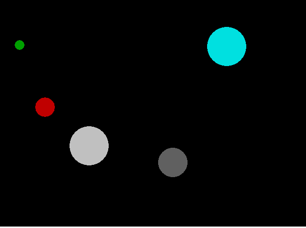

The program reads the spheres' data from the input.txt file, and then
places the spheres in a closed container,it presents the shocks that will occur
during the motion of the spheres by using graphics in C.

If you want to use the main.exe file to visualize the collisions, make sure to have the input.txt file in the same folder as the executable.
